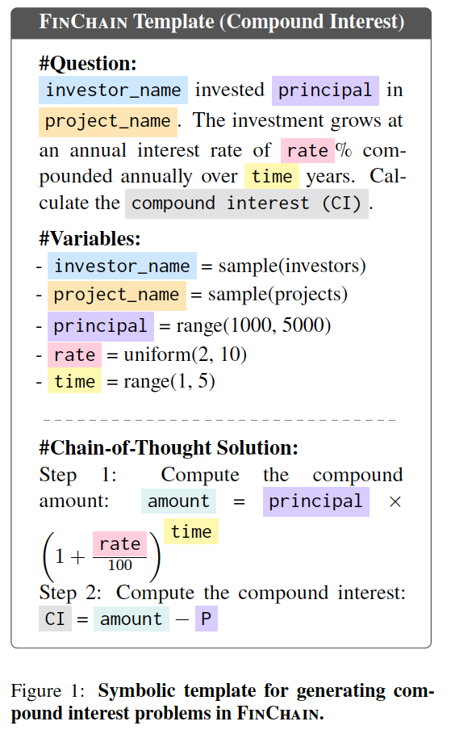
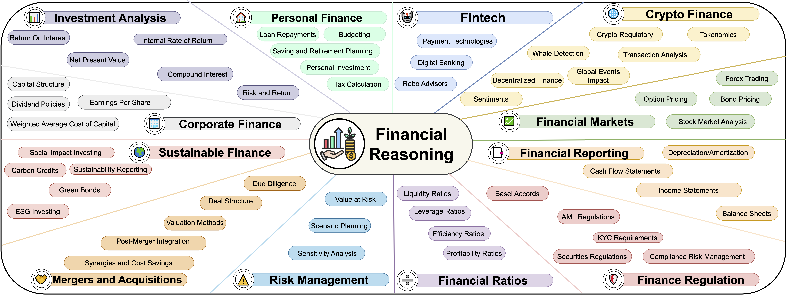

<div align="center">


<h1>FinChain</h1>
<p><em>A Symbolic Benchmark for Verifiable Chain-of-Thought
Financial Reasoning</em></p>

<a href='https://arxiv.org/abs/2506.02515'></a> &nbsp;
<a href='https://mbzuai-nlp.github.io/finchain/'></a> &nbsp;
<a href='https://mbzuai-nlp.github.io/finchain/leaderboard.html'></a> &nbsp;
<a href='https://huggingface.co/spaces/Usmansafder/finchain-space'></a>

</div>

## 🔍 Overview

**FinChain** is the first benchmark designed for **verifiable chain-of-thought (CoT) financial reasoning**. It evaluates large language models on symbolic, multi-step problem-solving tasks grounded in financial equations. Built from scratch using a fine-grained financial taxonomy, FinChain enables step-level supervision and robust diagnostic evaluation.

> 📄 Paper: *FinChain: A Symbolic Benchmark for Verifiable Chain-of-Thought
Financial Reasoning* (EMNLP 2025 submission)

## 📚 Key Features

- **58 topics** across **12 financial domains**
- **5 symbolic templates per topic** (2 easy, 2 intermediate, 1 advanced)
- **2,900 machine-verifiable instances** (58 topics × 5 templates × 10 seeds)
- **Executable Python traces** for step-level answer verification
- **ChainEval**, a custom metric for evaluating both final answers and intermediate steps

## 🧠 Example Template

<p align="center">
  
</p>

This example shows a symbolic template for Compound Interest:
- Parameterized with named variables (e.g., `principal`, `rate`, `time`)
- Includes both natural language and step-by-step symbolic solution
- Fully executable and verifiable

## 🗂️ Dataset Structure

```
finchain/
├── assets/               # Logos, taxonomy visuals, and supporting figures
├── chaineval/            # ChainEval metric implementation & aggregation
├── data/
│   └── templates/        # Symbolic prompt templates for 58 financial topics
├── website/              # Static site & leaderboard assets
└── README.md
```

Each instance includes:
- A financial problem generated from symbolic templates
- Gold reasoning trace with intermediate variables and calculations
- Executable code for ground-truth generation and verification

## 🧭 Taxonomy of Domains and Topics

FinChain covers 58 financial topics across 12 domains:

<p align="center">
  
</p>

Domains include:
- Corporate Finance
- Investment Analysis
- Personal Finance
- Financial Ratios
- Risk Management
- Sustainable Finance
- Mergers & Acquisitions
- Financial Markets
- Fintech
- Crypto Finance
- Financial Reporting
- Finance Regulation

## 🧪 ChainEval Metric

FinChain introduces **ChainEval**, a joint evaluation framework for:
- ✅ **Final Answer Correctness (FAC)**
- 🔗 **Step Alignment** via:
  - Semantic similarity of reasoning steps
  - Numerical agreement at each step

This allows precise tracking of where models hallucinate, skip, or miscalculate.

## 📈 Benchmarking Results

We evaluate **26 models** spanning four categories:
- **Frontier proprietary**: GPT-5/4.1 (+ mini variants), Claude Sonnet 4.5/4/3.7, Gemini 2.5 Pro/Flash, DeepSeek V3.x/R1, Grok 4 Heavy/Fast
- **Finance-specific**: Fino1, FinR1, DianJin-R1, WiroAI Finance-LLaMA, WiroAI Finance-Qwen
- **Math-enhanced**: WizardMath, MetaMath, Mathstral, Qwen2.5-Math
- **General-purpose open**: LLaMA 3.1, Qwen 2.5/3

**Findings:**
- Frontier models lead ChainEval yet still struggle on advanced, compositional templates
- Finance-tuned and math-enhanced 7B models (FinR1, Mathstral) approach frontier performance under ChainEval
- Domain-wise analysis shows frontier systems remain balanced, while fine-tuned models excel in their target areas (e.g., FinR1 in reporting/risk, Mathstral in quantitative domains)
- Accuracy drops across all model families from basic to advanced templates, highlighting persistent gaps in symbolic financial reasoning

## 🚀 Quick Start

```bash
git clone https://github.com/mbzuai-nlp/finchain.git
cd finchain
```

Explore templates:
```bash
ls data/templates/
```

Generate sample problems (each template script exposes a `main()` helper):
```bash
python data/templates/investment_analysis/npv.py
```

Evaluate model predictions with ChainEval:
```bash
python chaineval/evaluate_predictions.py --input path/to/your_outputs.jsonl --output evals/
```

Aggregate metrics across domains, subtopics, and difficulty levels:
```bash
python chaineval/aggregate.py
```

## 📘 Documentation

- Detailed methodology, data pipeline, and evaluation discussion are available in the accompanying paper (`paper.pdf`).

## 💬 Feedback & Contributions

**FinChain is an ongoing project**, and we’re continuously working to expand its coverage, refine evaluation metrics, and improve data quality. We **welcome feedback, suggestions, and community contributions**—whether it's about financial domains we missed, new evaluation ideas, or improving symbolic template diversity. If you're interested in collaborating or contributing, feel free to open an issue or contact us directly.

## 📄 Citation

If you find **FinChain** useful in your research, please consider citing our paper:

```bibtex

@article{xie2025finchain,
  title={FinChain: A Symbolic Benchmark for Verifiable Chain-of-Thought Financial Reasoning},
  author={Xie, Zhuohan and Orel, Daniil and Thareja, Rushil and Sahnan, Dhruv and Madmoun, Hachem and Zhang, Fan and Banerjee, Debopriyo and Georgiev, Georgi and Peng, Xueqing and Qian, Lingfei and Huang, Jimin and Su, Jinyan and Singh, Aaryamonvikram and Xing, Rui and Elbadry, Rania and Xu, Chen and Li, Haonan and Koto, Fajri and Koychev, Ivan and Chakraborty, Tanmoy and Wang, Yuxia and Lahlou, Salem and Stoyanov, Veselin and Ananiadou, Sophia and Nakov, Preslav},
  journal={arXiv preprint arXiv:2506.02515},
  year={2025}
}


```


## 👥 Authors

FinChain is developed by:

Zhuohan Xie, Daniil Orel, Rushil Thareja, Dhruv Sahnan, Hachem Madmoun,  
Fan Zhang, Debopriyo Banerjee, Georgi Georgiev, Xueqing Peng, Lingfei Qian,  
Jimin Huang, Jinyan Su, Aaryamonvikram Singh, Rui Xing, Rania Elbadry,  
Chen Xu, Haonan Li, Fajri Koto, Ivan Koychev, Tanmoy Chakraborty,  
Yuxia Wang, Salem Lahlou, Veselin Stoyanov, Sophia Ananiadou, Preslav Nakov

Affiliations: MBZUAI, Syllogia, The University of Tokyo, Sofia University "St. Kliment Ohridski", The Fin AI, Cornell University, The University of Melbourne, IIT Delhi, INSAIT, The University of Manchester

For questions or collaborations, contact: **zhuohan.xie@mbzuai.ac.ae**


## ⚖️ License


---

> **Disclaimer**: FinChain uses synthetic data based on symbolic financial equations. It does not reflect real-world financial advice or regulation.
